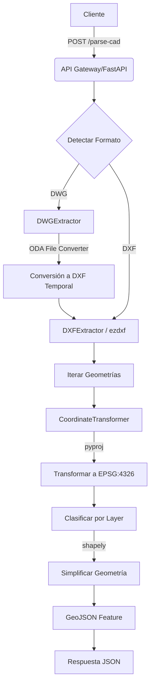

# Arquitectura - Plotify CAD Microservice

## 🏗️ Visión General
Este microservicio es responsable exclusivamente del procesamiento pesado de archivos CAD (DWG/DXF) y la transformación geoespacial.

## 📦 Componentes Principales

### 1. API Layer (`src/api/`)
Expone endpoints RESTful utilizando **FastAPI**. El servicio corre por defecto en el puerto **8001**.
- **`/health`**: Monitoreo de estado.
- **`/api/v1/validate-cad`**: Validación rápida de headers y estructura de archivos antes del procesamiento.
- **`/api/v1/parse-cad`**: Endpoint principal de procesamiento. Recibe archivos y parámetros de transformación.

### 2. Service Layer (`src/services/`)
Contiene la lógica de negocio pura, desacoplada de la capa HTTP.
- **`CADParser`**: 
  - Orquestador que detecta el formato del archivo.
  - Delega a extractores especializados: `DXFExtractor` y `DWGExtractor`.
- **`Extractors` (`src/services/cad/extractors.py`)**:
  - **`DXFExtractor`**: Procesa DXF nativamente con `ezdxf`.
  - **`DWGExtractor`**: Convierte DWG a DXF al vuelo usando **ODA File Converter** y luego procesa.
- **`CoordinateTransformer`**:
  - Abstrae `pyproj` para la transformación de coordenadas.
  - Convierte de CRS proyectados (ej. UTM Zona 19S) a Geográficas WGS84 (Lat/Lon).

### 3. Data Schema Layer (`src/schemas.py`)
Define los contratos de datos estrictos usando **Pydantic v2**.
- **`GeoJSONFeatureCollection`**: Estándar de salida para interoperabilidad con el frontend (Mapbox/Leaflet) y PostGIS.
### 3. Data Schema Layer (`src/schemas.py`)
Define los contratos de datos estrictos usando **Pydantic v2**.
- **`GeoJSONFeatureCollection`**: Estándar de salida para interoperabilidad con el frontend (Mapbox/Leaflet) y PostGIS.
- **`ProcessedCADResponse`**: Extensión del FeatureCollection que añade metadatos (`filename`, `metadata`) como miembros foráneos en la raíz del objeto JSON, eliminando anidación innecesaria.

## 🔄 Flujo de Datos: Procesamiento CAD

## 🔐 Seguridad y Operaciones

### Multitenancy y Aislamiento
El sistema sigue un estricto modelo de aislamiento lógico.
- **`x-project-id` (Header)**: Obligatorio en todos los endpoints de procesamiento. Este ID no solo traza la operación, sino que en el futuro permitirá aplicar políticas de transformación específicas por proyecto o región.

### Modelo de Concurrencia (CPU-Bound)
El procesamiento CAD es intensivo en CPU.
- Aunque FastAPI es asíncrono, la librería `ezdxf` es síncrona.
- **Solución implementada**: El parsing y simplificación geométrica se ejecutan en un **Threadpool** (`run_in_threadpool`) para evitar bloquear el Event Loop principal de Python. Esto garantiza que el servicio pueda seguir respondiendo a healthchecks y otras requests ligeras mientras procesa un archivo grande.

### Variables Críticas
- `ALLOWED_ORIGINS`: Lista blanca de orígenes CORS (vital para bloquear peticiones de dominios no autorizados).
- `API_PREFIX`: Prefijo de versión (ej: `/api/v1`).

## ⚠️ Mapeo de Errores y Códigos de Estado

Para facilitar la integración con el cliente, el microservicio estandariza sus respuestas de error:

| Código HTTP | Escenario de Negocio | Causa Común |
| :--- | :--- | :--- |
| **400 Bad Request** | Solicitud Mal Formada | Falta header `x-project-id`, EPSG de origen inválido o no soportado. |
| **422 Unprocessable Entity** | Archivo Inválido (Parsing) | El archivo no es un DXF/DWG válido, está corrupto, o no contiene entidades geométricas soportadas. |
| **413 Payload Too Large** | Archivo Excede Límites | (Configurable) El archivo subido supera el tamaño máximo permitido por Nginx/FastAPI. |
| **500 Internal Server Error** | Error de Sistema | Fallo inesperado en transformación de coordenadas o bug en la librería de parsing. Requiere revisión de logs. |

## 📐 Decisiones de Diseño

### ezdxf vs dxfgrabber
Se seleccionó **ezdxf** por su mantenimiento activo, soporte robusto para versiones modernas de DXF (hasta R2018) y capacidad de manejar archivos binarios y de texto con mayor resiliencia que librerías abandonadas como `dxfgrabber`.

### Manejo de Coordenadas
El sistema no asume la proyección de entrada. Se requiere el parámetro `source_epsg` (default 32719 para Chile Central) para garantizar la precisión en la transformación a WGS84, estándar global para aplicaciones web modernas.

### Simplificación de Geometría
Se utiliza el algoritmo de Douglas-Peucker (vía `shapely`) para reducir la densidad de vértices en polígonos complejos, optimizando el peso del payload JSON y el rendimiento de renderizado en el cliente, sin sacrificar la precisión topológica visual.
