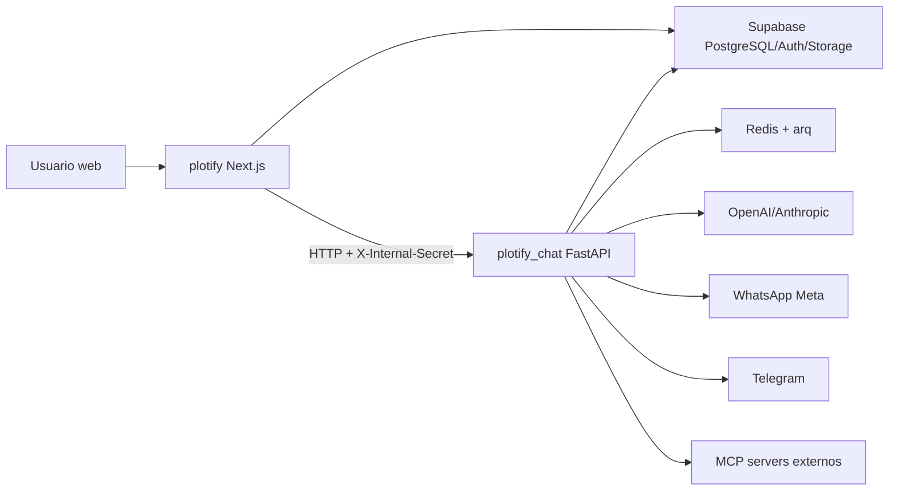

# Mapa de Integracion Frontend Backend

> [!info]
> Esta nota documenta como se conectan `plotify/` y `plotify_chat/`. Sirve como mapa para decidir ownership, contratos y responsabilidades.

## Vista de alto nivel

## Responsabilidades por codigo

| Area | `plotify/` | `plotify_chat/` | Contrato |
|---|---|---|---|
| Autenticacion usuario | Supabase SSR, middleware, Server Actions | Valida `X-Internal-Secret`; super-admin por `X-User-Id` | Supabase Auth + headers internos |
| Multitenancy | RLS por `organization_id`; membership en `organization_members` | Service role + `organization_id` en payload/state | DB compartida |
| Proyectos/lotes | UI, CRUD, onboarding, operaciones | Tools de consulta para agente | Tablas `projects`, `lots`, `lot_records`, `geometries` |
| Geometria | Parser KMZ/KML, MapLibre, calculos m2/servidumbre | No procesa geometria principal | DB + tipos GeoJSON |
| Reservas/ventas | Server Actions llaman RPC Supabase | Aprobaciones y notificaciones | RPC `reserve_lot`, `direct_sale_lot`, `approval_requests` |
| Documentos | UI de plantillas, bloques, wizard, historial | Render Jinja2, PDF/DOCX, Storage | `/api/v1/documents/*` + tablas documentales |
| Agente IA | Pantallas de skills, integraciones, Prompt Ops | LangGraph, prompts, skills, MCP gateway | Tablas `system_prompts`, `agent_skills`, `mcp_connections` |
| Mensajeria | Vinculacion Telegram en dashboard | Webhooks Meta/Telegram, envio de mensajes, workers | API webhook + Redis jobs |

## Puente HTTP actual

Archivo frontend: `plotify/src/lib/services/microservice.client.ts`

- Base URL: `PLOTIFY_CHAT_BASE_URL`, default `http://127.0.0.1:8005`.
- Header obligatorio: `X-Internal-Secret`.
- Header adicional actual: `Authorization: Bearer <token>` si se pasa `superAdminToken`.
- Respuesta estandarizada: `{ data, error, status }`.

Archivo backend: `plotify_chat/api/deps.py`

- `verify_internal_secret` valida `X-Internal-Secret`.
- `verify_super_admin` valida `X-Internal-Secret` y `X-User-Id`, luego consulta `profiles.is_super_admin`.

> [!warning]
> El frontend y backend no coinciden para super-admin: el frontend envia `Authorization: Bearer`, pero el backend espera `X-User-Id`. Esto afecta Prompt Ops si se usa el microservicio directamente.

## Endpoints FastAPI relevantes

| Area | Endpoint | Uso esperado |
|---|---|---|
| Health | `GET /api/v1/health` | Health check |
| Webhooks | `GET/POST /api/v1/webhook/meta` | Meta verification y recepcion WhatsApp |
| Webhooks | `POST /api/v1/webhook/telegram/{org_id}` | Recepcion Telegram por organizacion |
| Bots | `/api/v1/bots/*` | Registro/listado/borrado de bots Telegram |
| Users | `POST /api/v1/users/telegram-token` | Token de vinculacion Telegram |
| Approvals | `POST /api/v1/approvals/request-reservation` | Solicitud de aprobacion de reserva |
| Prompts | `/api/v1/prompts/*` | Versionado y sandbox de prompts |
| Skills | `POST /api/v1/skills/invalidate-cache` | Invalidar cache Redis de skills |
| Documents | `/api/v1/documents/*` | Preview, generacion, templates, bloques, historial |
| Integrations | `/api/v1/integrations/*` | MCP connections, test y revocacion |

## Contratos que requieren cierre

### Documentos

- Backend `PreviewRequest` exige `template_id`, `lot_id`, `organization_id`.
- Frontend `PreviewRequest` no incluye `organization_id` y agrega `variables_override`.
- Backend `GenerateRequest` exige `organization_id`; frontend no lo manda desde `generateDocumentAction`.
- Backend responde `file_url` y `format`; frontend tipa `file_url` y `document_id`.
- `GenerationWizard` recibe `organizationId`, pero no lo usa en `handleGenerate`.

### Prompt Ops

- Backend activa version con `PUT /api/v1/prompts/{prompt_id}/activate/{version_id}`.
- Frontend service usa `POST /api/v1/prompts/{promptId}/versions/{versionId}/activate`.
- Backend sandbox es `POST /api/v1/prompts/sandbox`.
- Frontend service usa `POST /api/v1/prompts/sandbox/test`.
- Componentes UI llaman `/api/prompt-ops/...`, pero no existen route handlers `src/app/api/prompt-ops`.

### Skills

- Frontend `toggleOrgSkill` escribe `org_skill_configs`.
- Backend existe `POST /api/v1/skills/invalidate-cache`.
- No se encontro llamada desde el frontend a `invalidate-cache`; el cache Redis puede vivir hasta 5 minutos.

## Dependencias compartidas por DB

- Core negocio: `profiles`, `organizations`, `organization_members`, `projects`, `lots`, `lot_records`, `geometries`, `vendors`, `vendor_projects`, `approval_requests`, `audit_logs`.
- Agente: `system_prompts`, `prompt_versions`, `agent_skills`, `org_skill_configs`, `agent_custom_instructions`.
- Documentos: `document_blocks`, `document_templates`, `template_block_items`, `generated_documents`.
- MCP: `mcp_connections`.
- Microservicio: `leads`, `organization_payment_info`, `dead_letter_queue`.

## Decision tecnica sugerida

> [!todo]
> Definir un contrato versionado para `plotify_chat`, idealmente OpenAPI generado desde FastAPI y consumido por un cliente TypeScript. Mientras eso no exista, cada feature que cruce el puente debe tener una nota de contrato: request, response, auth, errores y ownership.

## Relacionado

- [[Revision Integral 2026-04-14]]
- [[Riesgos y Brechas Tecnicas]]
- [[Matriz de Decisiones Pendientes]]
- [[Comunicacion entre Servicios]]
- [[API Endpoints Microservicio]]
- [[Server Actions]]
