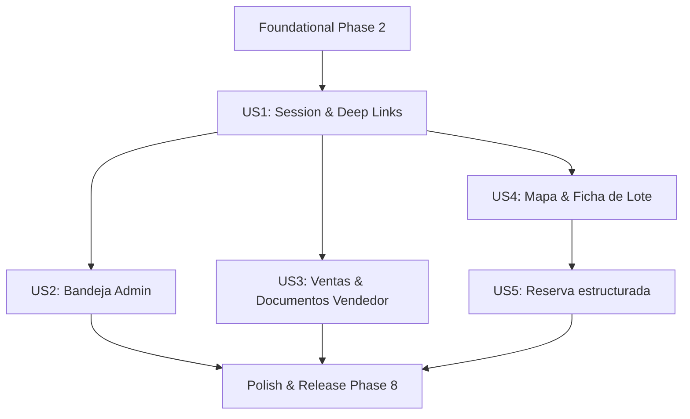

# Tasks: Mini App de Telegram — sala de operaciones de bolsillo

**Input**: Design documents from `/specs/018-telegram-mini-app/`

**Prerequisites**: plan.md (required), spec.md (required for user stories), agent-guide.md, contracts/

**Tests**: Tests are required per agent-guide.md. Tests must be written and passed.

**Organization**: Tasks are grouped by user story to enable independent implementation and testing of each story.

## Format: `[ID] [P?] [Story] Description`

- **[P]**: Can run in parallel (different files, no dependencies)
- **[Story]**: Which user story this task belongs to (e.g., US1, US2, US3)
- Include exact file paths in descriptions

---

## Phase 1: Setup (Shared Infrastructure)

**Purpose**: Project initialization and base structure configuration

- [x] T001 Initialize miniapp route structure and register mock page in apps/web/src/app/mini/page.tsx
- [x] T002 Configure Telegram Mini App configuration keys and validation parameters in apps/api/core/config.py
- [x] T003 Create empty router apps/api/api/v1/endpoints/miniapp.py and register prefix /miniapp in apps/api/api/v1/router.py

---

## Phase 2: Foundational (Blocking Prerequisites)

**Purpose**: Core security and session infrastructure that MUST be complete before ANY user story can be implemented

- [x] T004 Implement Telegram initData HMAC validation and JWT token issuance in apps/api/core/miniapp_session.py
- [x] T005 Implement verify_miniapp_session dependency for route authorization in apps/api/core/miniapp_session.py
- [x] T006 Write unit tests for HMAC vectors, expiration checks, and roles in apps/api/tests/test_miniapp_auth.py
- [x] T007 [P] Create shared types and API schemas for auth in apps/api/schemas/miniapp.py

**Checkpoint**: Foundation ready - user story implementation can now begin

---

## Phase 3: User Story 1 - Sesión sin fricción y apertura contextual (Priority: P1) 🎯 MVP

**Goal**: Authenticate users seamlessly via Telegram initData, resolve roles, deep link correctly, and handle unlinked status.

**Independent Test**: Execute quickstart scenario 1 E2E: mock valid initData, request session, confirm user resolved, test invalid initData rejects (401), open deep link.

### Tests for User Story 1

- [x] T008 [P] [US1] Write integration tests for session endpoints and deep links in apps/api/tests/test_miniapp_auth.py
- [x] T009 [P] [US1] Write frontend unit tests for hook useTelegram and session wrapper in apps/web/src/lib/miniapp/telegram.test.ts

### Implementation for User Story 1

- [x] T010 [US1] Implement session endpoints POST /api/v1/miniapp/session in apps/api/api/v1/endpoints/miniapp.py
- [x] T011 [US1] Implement core Telegram Mini App SDK wrapper hook in apps/web/src/lib/miniapp/telegram.ts
- [x] T012 [US1] Implement session manager and local token storage in apps/web/src/lib/miniapp/session.ts
- [x] T013 [US1] Create dynamic main layout and provider in apps/web/src/app/mini/layout.tsx
- [x] T014 [US1] Implement onboarding screen for unlinked chats in apps/web/src/app/mini/vincular/page.tsx
- [x] T015 [US1] Implement role-based router page in apps/web/src/app/mini/page.tsx
- [x] T016 [US1] Modify telegram client methods to allow setChatMenuButton in apps/api/integrations/telegram_client.py
- [x] T017 [US1] Add web_app button to reservation approvals in apps/api/workers/tasks/approval_notifier.py
- [x] T018 [US1] Add web_app button to cascade exception notifications in apps/api/services/escritura_notifications.py

**Checkpoint**: User Story 1 complete - frictionless authentication and Deep Linking work seamlessly.

---

## Phase 4: User Story 2 - Admin decide con contexto: sala de excepciones (Priority: P1)

**Goal**: Provide admins with a unified inbox of pending approvals and cascade exceptions with side-by-side evidence, allowing direct actions (approve/reject/retry cascade).

**Independent Test**: Create a pending approval and cascade exception in the DB, log in as admin, check details (conflict variables, evidence), and approve/reject/retry. Verify results in DB and audit logs.

### Tests for User Story 2

- [x] T019 [US2] Write integration tests for bandeja data listing and decision actions in apps/api/tests/test_miniapp_endpoints.py

### Implementation for User Story 2

- [x] T020 [US2] Implement API endpoints GET /api/v1/miniapp/bandeja and GET /api/v1/miniapp/bandeja/{id} in apps/api/api/v1/endpoints/miniapp.py
- [x] T021 [US2] Implement decision endpoints POST /api/v1/miniapp/bandeja/{approval_id}/decidir and POST /api/v1/miniapp/bandeja/{case_id}/reintentar-cascada in apps/api/api/v1/endpoints/miniapp.py
- [x] T022 [US2] Create bandeja inbox dashboard interface in apps/web/src/app/mini/bandeja/page.tsx
- [x] T023 [US2] Create bandeja detailed view displaying side-by-side conflicts and action buttons in apps/web/src/app/mini/bandeja/[id]/page.tsx

**Checkpoint**: User Story 2 complete - admins can resolve exceptions and approve cases natively.

---

## Phase 5: User Story 3 - Vendedor: mis ventas y mis documentos (Priority: P2)

**Goal**: Provide vendors with a view of their sales, status in pipeline, humanized blockers, and direct download links for generated minutas.

**Independent Test**: Create cases and deliveries for a vendor, log in, confirm only vendor's items are visible, verify humanized explanation of blockers, download minuta with valid signed link.

### Tests for User Story 3

- [x] T024 [US3] Write integration tests for sales and document delivery endpoints in apps/api/tests/test_miniapp_endpoints.py

### Implementation for User Story 3

- [x] T025 [US3] Implement endpoints GET /api/v1/miniapp/ventas and GET /api/v1/miniapp/ventas/{case_id} with humanized blockers in apps/api/api/v1/endpoints/miniapp.py
- [x] T026 [US3] Implement endpoint GET /api/v1/miniapp/documentos for delivery listings in apps/api/api/v1/endpoints/miniapp.py
- [x] T027 [US3] Create sales pipeline list screen in apps/web/src/app/mini/ventas/page.tsx
- [x] T028 [US3] Create case detailed view showing humanized blockers in apps/web/src/app/mini/ventas/[caseId]/page.tsx
- [x] T029 [US3] Create documents cabinet list screen in apps/web/src/app/mini/documentos/page.tsx

**Checkpoint**: User Story 3 complete - vendors can track status and retrieve minutas independently.

---

## Phase 6: User Story 4 - Visor de parcelas con ficha de lote (Priority: P2)

**Goal**: Interactive MapLibre map displaying lots colored by availability, displaying lot details (size, price, state) upon tap, and option to share lot parameter.

**Independent Test**: Select a project, load map, tap lot, view sheet details. Share link to chat, verify start_param is parsed to open the same lot detail.

### Tests for User Story 4

- [x] T030 [US4] Write integration tests for lot detail and project map endpoints in apps/api/tests/test_miniapp_endpoints.py

### Implementation for User Story 4

- [x] T031 [US4] Reuse geometry endpoints or implement GET /api/v1/miniapp/proyectos/{project_id}/mapa and GET /api/v1/miniapp/lotes/{lot_id} in apps/api/api/v1/endpoints/miniapp.py
- [x] T032 [US4] Create interactive MapLibre canvas for mobile views in apps/web/src/app/mini/mapa/page.tsx
- [x] T033 [US4] Create sheet view component for selected lot information in apps/web/src/app/mini/mapa/lot-sheet.tsx
- [x] T034 [US4] Implement startapp share_param parsing inside miniapp routes in apps/web/src/app/mini/page.tsx

**Checkpoint**: User Story 4 complete - interactive land search and lot sheets are live.

---

## Phase 7: User Story 5 - Reserva estructurada desde ficha (Priority: P3)

**Goal**: Form-driven reservation submission from lot sheet, verifying RUT formatting and client+server validations, ensuring idempotency and instant notifications.

**Independent Test**: Submit a reservation for an available lot, check approval_request generated, verify double submission yields a single request, try requesting already reserved lot (expect 409).

### Tests for User Story 5

- [x] T035 [US5] Write integration tests for reservation submission, validation errors, and idempotency in apps/api/tests/test_miniapp_reserva.py

### Implementation for User Story 5

- [x] T036 [US5] Refactor reservation creation logic out of agent tools to a shared service in apps/api/services/reservations.py
- [x] T037 [US5] Implement endpoint POST /api/v1/miniapp/reservas with idempotency key checks in apps/api/api/v1/endpoints/miniapp.py
- [x] T038 [US5] Create reservation input form schema and UI using react-hook-form in apps/web/src/app/mini/reserva/page.tsx (query param `?lot_id=`, matching the route `mapa/page.tsx` already calls, instead of a `[lotId]` dynamic segment — allowed deviation per plan.md's routing note)
- [x] T039 [US5] Integrate validation schemas and RUT checker helpers in apps/web/src/lib/miniapp/validation.ts (reuses `validateRut`/`formatRut` from `lib/validations/lot-reservation.schema.ts` instead of duplicating the RUT módulo-11 algorithm)

**Checkpoint**: User Story 5 complete - end-to-end booking flow from phone is fully operational.

---

## Phase 8: Polish & Cross-Cutting Concerns

**Purpose**: Cleanup, validation, and production readiness

- [x] T040 Setup bot commands and ChatMenuButton updates during registration in apps/api/services/bot_registration.py
- [x] T041 Review session audit logs and add miniapp source markers across endpoints (found and fixed a real mislabeling bug: `channel = "telegram" if admin_id.isdigit() else "web"` in approval_processor.py tagged miniapp-originated decisions as "web" since both use UUID admin_ids; added explicit `channel="miniapp"` passthrough. Also added missing session issuance/rejection and `miniapp.reserva_creada` audit events per agent-guide.md Constitution Check)
- [x] T042 Ensure Next.js dynamic routing is un-cached across apps/web/src/app/mini/layout.tsx (measured: `export const dynamic = 'force-dynamic'` is a documented no-op for a route where layout+page are 100% Client Components with no server data fetching — verified empirically with `next start` + curl, `x-nextjs-cache: HIT`/`s-maxage=31536000` persisted regardless. Fixed with (1) `next/dynamic({ssr:false})` splitting the shell into apps/web/src/lib/miniapp/mini-app-shell.tsx so no page content is baked into the prerendered artifact, and (2) an explicit `headers()` override in next.config.ts forcing `Cache-Control: private, no-cache, no-store, max-age=0, must-revalidate` on `/mini/:path*`, which does override Next's default per its own precedence rules — reverified with curl that the header is now correct)
- [x] T043 Run quality checks: pnpm lint, formatting check, and production builds across packages (all four agent-guide.md §4.5 gates green: `pnpm test:api` 737 passed, `pnpm test:web` 843 passed, `pnpm typecheck:web` clean, `pnpm build:web` clean; also `pnpm format:check` and `pnpm --filter web lint`. Found and fixed a real pre-existing gap along the way: SDD015's design guard tests (`loaders-guard.test.ts`, `raw-colors-guard.test.ts`) had no exemption for the mini app's Telegram-native dark theme — added a scoped `app/mini/` + `lib/miniapp/` exemption with rationale, since the mini app intentionally follows Telegram's `themeParams`, not the CRM's monochrome direction)
- [ ] T044 Validate all quickstart.md scenarios against live development sandbox — PARTIAL. Scenarios 0, 1 (steps 1–4), 2 (steps 1–5), 3, 4 (steps 1, 3, 4), 5 (steps 4) require a real dev bot behind ngrok, `TELEGRAM_MINI_APP_URL`, and two linked Telegram accounts (admin + vendor) — cannot be executed by an agent without a human driving a real Telegram client; needs manual run per agent-guide.md §4.1. What WAS run against the real Supabase project + local API and passed: 1.5 (initData hash tampered → 401, audited as `miniapp.session_rejected` with `channel: "miniapp"` — confirmed via direct DB read), 2.6 (vendor hitting `/mini/bandeja` and `/mini/bandeja/{id}/decidir` → 403 both), 4.1 (map GeoJSON/lot data cross-checked directly against `lots`/`geometries` — real numbers, not mocked), 5.5 (reserving a `vendido` lot → 409 with correct current-state message, no request created)

---

## Dependencies & Execution Order

### Phase Dependencies

- **Setup (Phase 1)**: No dependencies - can start immediately.
- **Foundational (Phase 2)**: Depends on Setup (Phase 1) - BLOCKS all user stories.
- **User Stories (Phase 3+)**: All depend on Foundational phase completion.
  - US1 (Phase 3) is the primary MVP.
  - US2 (Phase 4) and US3 (Phase 5) are independent from each other but depend on US1.
  - US4 (Phase 6) depends on US1.
  - US5 (Phase 7) depends on US1 and US4.
- **Polish (Phase 8)**: Depends on all user stories being complete.

### User Story Dependencies

### Parallel Opportunities

- Within Phase 2: Session encryption (T004) and schemas (T007) can be built in parallel.
- Once US1 (Phase 3) is completed, US2 (Phase 4), US3 (Phase 5), and US4 (Phase 6) can be implemented in parallel.
- Within US1: SDK hooks (T011) and dynamic layout wrappers (T013) can be worked on in parallel.

---

## Implementation Strategy

### MVP First (User Story 1 & 2)

1. Complete Setup and Foundational Phases.
2. Complete US1 (Sesión & Links) to enable authenticating users and redirection from bots.
3. Complete US2 (Bandeja Admin) so administrators can approve exceptions immediately.
4. Validate these features in staging before finishing remaining stories.
